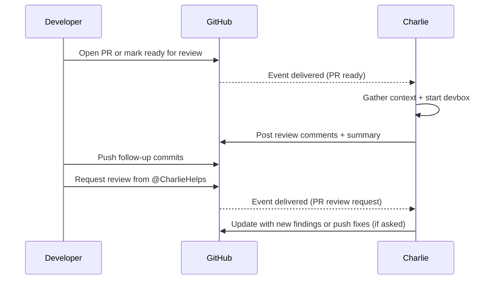

# Customization
Source: https://docs.charlielabs.ai/customization

All the ways to customize Charlie for your repository: instructions, playbooks, proactive behaviors, and configuration.

Charlie is designed to adapt to your repo and workflow. You can customize how Charlie plans, writes, and reviews code—and even have Charlie run safe automations on a schedule.

<Info>
  Charlie’s *instructions* and *playbooks* are conceptually similar to repo rule files like `AGENTS.md`, `CLAUDE.md`, and `.cursor/rules`, but tailored to Charlie’s capabilities and tooling—they let you customize how Charlie behaves in your repo.
</Info>

<CardGroup>
  <Card title="Instructions" icon="file-lines" href="/customization/instructions">
    Repo-specific rules and expectations that shape planning, coding, and reviews. Think policies and standards.
  </Card>

  <Card title="Playbooks" icon="list-check" href="/customization/playbooks">
    Small, step-by-step recipes for repeatable tasks. Loaded automatically when relevant to a task.
  </Card>

  <Card title="Proactive behaviors (beta)" icon="brain" href="/customization/proactive">
    Let Charlie execute selected playbooks automatically (e.g., Sentry triage, dead-code cleanup) and open PRs/issues for you.
  </Card>

  <Card title="Configuration" icon="gear" href="/customization/config">
    Repository-level config and environment variables that enable Charlie to run your tools and checks.
  </Card>
</CardGroup>

***

## Quickstart

* Create concise instruction files under `.charlie/instructions/*.md`—one topic per file.
* Add one high‑value playbook under `.charlie/playbooks/*.md`.
* (Optional) Keep directory‑scoped rules near code with `AGENTS.md`, `CLAUDE.md`, or `.cursor/rules/*.mdc`.
* Sanity‑check: open a tiny PR that violates an instruction (Charlie should flag it) and run a small task (Charlie should auto‑select the playbook).

***

## Instructions vs. Playbooks

**Instructions**

* What: repo‑specific rules and conventions that guide Charlie’s behavior and outputs.
* Where: `.charlie/instructions/*.md` (global). Charlie also reads `AGENTS.md`, `CLAUDE.md`, `.cursor/rules/*.mdc`, and root `.cursorrules`.
* When: applied during planning, coding, and reviews.
* Use cases: coding style, commands, review standards, naming, error handling, logging, commit/PR norms.

<Info>See the full [Instructions](/customization/instructions) guide for examples and a template.</Info>

**Playbooks**

* What: concise, step‑by‑step recipes for recurring tasks.
* Where: `.charlie/playbooks/*.md` (one per file; first H1 is the title).
* When: loaded when relevant to the task (never during PR review).
* Use cases: repeatable workflows and checklists with exact steps and guardrails.

<Info>See the full [Playbooks](/customization/playbooks) guide for structure and examples.</Info>

Why both? Instructions define the rules of the road; playbooks are actionable how‑tos loaded contextually.

***

## Recognized rule files

Charlie reads `AGENTS.md`, `CLAUDE.md`, `.cursor/rules/*.mdc`, and a root `.cursorrules` alongside `.charlie/instructions/*.md` as instruction sources. When both exist and collide, `.charlie/instructions/*.md` take priority. If Charlie must trim for the token budget, non‑`.charlie` rule files are trimmed first; `.charlie/instructions/*.md` are the last to be trimmed.


# Configuration
Source: https://docs.charlielabs.ai/customization/config

Environment variables, repository-level configuration, and CI tips.

<Info>See [Instructions](/customization/instructions) and [Playbooks](/customization/playbooks) to configure Charlie's behavior.</Info>

## Environment variables

Environment variables allow Charlie to run dev servers, tests, and other tools. They are set from [the dashboard](https://dashboard.charlielabs.ai/manage) and are injected into the Devbox (VM) Charlie operates in at runtime.

<Tip>Adding the environment variables required for local development of the repo will substantially improve Charlie's performance.</Tip>

Common variables you might add:

* Non-production tokens, secrets, config, for local development of the repo (e.g. the contents of `.env` files).
* E2E/dev server knobs (e.g., `PLAYWRIGHT_*`, `CYPRESS_*`, framework‑specific `NEXT_PUBLIC_*`, `VITE_*`).
* `NPM_TOKEN` (or `NPM_AUTH_TOKEN`) – Install private NPM packages.
* Remote cache or CI tokens used by your build (e.g., `TURBO_TOKEN`/`TURBO_TEAM` if you use Turborepo remote caching).

<Tip>Adding `TURBO_TOKEN` & `TURBO_TEAM` will make Charlie faster because he frequently runs Turbo tasks when available.</Tip>

### How to add environment variables

Environment variables are added from [the dashboard](https://dashboard.charlielabs.ai/manage) and are scoped to a single repository.

1. Navigate to the [dashboard](https://dashboard.charlielabs.ai/manage).
2. Choose the organization the repo belongs to (you will automatically be redirected if you only have one).
3. Click the "ENV VARS" link for the repo you want to add variables to.
4. Enter the name and value for each variable (values are encrypted at rest).

## Repository configuration

Location: `.charlie/config.yml` on the default branch.

Changes take effect after merging to the default branch. If the file is missing or invalid, safe defaults are used.

### Schema and behavior

* `checkCommands: { fix?, lint?, types?, test? }` – Shell commands Charlie can run inside the Devbox.
  * All commands run from the repository root inside the Devbox.
  * `fix` is run after Charlie edits code (format/lint autofix, codegen, etc.).
  * `types` enables a TypeScript verification step when provided.
  * `lint` runs your linters (for example, ESLint).
  * `test` runs your unit tests (not E2E or integration tests).
* `beta` – Experimental feature toggles:
  * `canApprovePullRequests` (default: false) – Allow Charlie to post an “Approve” review when appropriate (never for Charlie‑authored PRs).
  * `proactive` – Opt‑in list of playbooks to execute automatically each day. Each item is an object with a single `playbook` field pointing to a file path in your repo (additional fields are not supported in beta). See Proactive Behaviors for details.

### Example config

```yml theme={null}
checkCommands:
  fix: bun run fix
  lint: bun run lint
  types: bun run typecheck
  test: bun run test
beta:
  canApprovePullRequests: false
  proactive:
    - playbook: ".charlie/playbooks/sentry-triage.md"
    - playbook: ".charlie/playbooks/auto-update-docs-site.md"
    - playbook: ".charlie/playbooks/dead-code-cleanup.md"
    - playbook: ".charlie/playbooks/upgrade-outdated-dependency.md"
```

<Tip>
  Monorepo tip: many teams expose aggregate scripts like `fix:all`, `lint:all`, `typecheck:all`, and `test:all` that fan out with a task runner (for example, Turborepo). It’s a good idea for your `lint` step to also enforce a Prettier check (and optionally an unused code/deps check like Knip) so formatting and hygiene failures are caught during verification.
</Tip>

#### Example (monorepo aggregates)

```yml theme={null}
checkCommands:
  fix: bun run fix:all       # e.g., ESLint --fix + Prettier write
  lint: bun run lint:all     # e.g., ESLint + Prettier check + Knip
  types: bun run typecheck:all
  test: bun run test:all
```

### Additional notes

* Invalid or misshaped values are ignored per‑field and replaced with defaults (other valid keys are preserved).

## FAQs

### “We merged config changes but nothing changed.”

Config is read from the default branch; ensure the file lives at `.charlie/config.yml` and changes are merged to default.

### “Charlie approved a PR.”

That only happens if `beta.canApprovePullRequests` is true, the review found no significant issues, and the PR isn’t authored by Charlie.


# Instructions
Source: https://docs.charlielabs.ai/customization/instructions

Repo-specific rules and expectations that shape Charlie’s behavior and outputs.

Instructions are always present in Charlie’s context. The entire instruction set is capped by a global token budget, so keep guidance tight and high‑signal.

<Info>
  If your guidance is a repeatable procedure for a specific task, prefer [Playbooks](/customization/playbooks). For a quick tour of all customization options, see the [Customization overview](/customization).
</Info>

## What to include

* Clear instructions: “Always/Prefer/Never” statements.
* Concrete standards: file layout, naming, typing patterns; development commands; error handling; logging; dependency conventions; commit/PR norms.
* Tiny Good/Bad examples (helpful but trimmed first under budget).
* Glossary entries for repo‑specific terms and domain jargon.
* Links to resources: URLs for repo paths with extended info (Note: links aren't followed during PR review).
* Directory‑scoped guidance where it truly differs (put `AGENTS.md` / `CLAUDE.md` / `.cursor/rules/*.mdc` next to the code).

## What to exclude

* Never: secrets, tokens, credentials.
* Vague language like “should generally,” “consider” without a default. Use **Always/Prefer/Never when X**.
* Philosophy, essays, or long rationale — link out to vendor docs instead.
* Large code blocks, generated outputs, or changelogs.
* One‑off “project diary” notes that won’t age well.
* Duplicated guidance across files — keep one canonical instruction per topic.
* Instructions that require capabilities you haven’t granted (e.g., “post to Slack” without Slack connected).

## Style & structure

* Voice: imperative, specific, short sentences, active verbs, concrete defaults.
* Format: prefer Do/Don’t bullets over paragraphs.
* Precision: name files, symbols, and scripts exactly; show the minimal command/snippet.
* Organization: create a `.charlie/instructions/*.md` file for each topic (e.g. glossary, dev commands, TypeScript).

## Recommended template

Use this template as a starting point when creating a new instruction file. It keeps rules concise and groups examples separately while allowing snippets to reference specific rules via stable IDs like `[R1]`. This is a suggestion only—use any subset of sections/formatting that fits your repo and delete anything that doesn’t apply.

````md theme={null}
# <Title>

<1–2 sentences on what this covers and why it matters.>

## Scope
<Paths and contexts where this applies (focus on globs, e.g., `apps/**`, `packages/*/src/**/*.ts`).>

## Context
- <Background or team‑specific nuance that clarifies rules where code alone isn’t clear.>
- <Assumptions/constraints decided by the team that Charlie wouldn’t infer from the repo or public docs.>

## Rules
- [R1] <Imperative rule, one line.>
- [R2] <Imperative rule, one line.>
- [R3] <Imperative rule, one line.>
  - Optional note for nuance (one bullet only).

## Examples

### Good examples

- [R1] — <short title for the snippet>
```ts
// minimal, runnable snippet for R1
```

- [R3] — <another good example>
```ts
// minimal, runnable snippet for R3
```

### Bad examples

- [R2] — <short title for the anti‑pattern>
```ts
// short anti‑pattern for R2
```

## References

1. <Short label> — <https://example.com/path-or-relative-doc>
2. <Short label> — ./relative/path.md
````

<Info>
  Tip: Keep the Rules list stable once published so example references like "R3" don't drift. If you must reorder, update the example captions to match.
</Info>

## Example rule files

Use these copy‑ready examples to seed your own `.charlie/instructions/*.md` files. Paste them as‑is, then tweak to match your stack.

### TypeScript

````md .charlie/instructions/core/typescript.md theme={null}
# TypeScript Conventions

Keep TypeScript strict, modern, and ESM‑native so code is predictable and interoperable across tools.

## Scope
Applies to all TypeScript in this repo, especially `apps/**` and `packages/**` sources and tests.

## Context
- Strict type safety and avoiding use of `any` or unsafe casts is EXTREMELY important.
- The codebase uses pure ESM with NodeNext resolution. Relative imports must include the `.js` file extension even in `.ts` files to match runtime resolution.

## Rules
- [R1] ABSOLUTELY NEVER use `any` for ANYTHING other than tests/fixtures or generic default type parameters. Prefer `unknown` or `unknown[]` for generics.
- [R2] NEVER use non‑null assertions (`!`) and blanket casts (`as T`). Prefer `unknown` + Zod or type guards; use generics and `satisfies` to keep types precise.
- [R3] Use ESM `import`/`export` only. Never use `require()`/`module.exports`.
- [R4] In relative imports, include the `.js` suffix (NodeNext). Example: `import { foo } from './foo.js'` from a `.ts` file.
- [R5] Prefer named exports. Default exports are allowed only when a framework requires them (e.g., CLI command classes or framework route modules).
- [R6] Prefer unions over enums. Use `z.enum([...])` only for schemas solely consumed by `llm.generateObject()`.
- [R7] Use type‑only imports for types: `import type { Foo } from './types.js'`.
- [R8] Prefer discriminated unions for state and result types instead of boolean flags.
- [R9] Do not add custom `.d.ts` files to silence errors. Install missing `@types/*` or fix the import/module path.
- [R10] Use `const` by default; never use `var`.
- [R11] Use modern standard APIs by default (`fetch`, `URL`, `Blob`). Avoid large runtime deps for trivial tasks.

## Examples

> Note: In NodeNext ESM, include the `.js` suffix in relative imports even in `.ts` files.

### Good examples

- [R4][R5][R7][R8][R10] — Minimal ESM import + named export + type‑only import + discriminated union
```ts
import type { User } from './types.js'
type Result = { status: 'ok'; count: number } | { status: 'error'; reason: 'not-found' }
export const area = (r: number): number => Math.PI * square(r)
```

- [R2] — Type guard helper using `key in obj` for safe narrowing
```ts
type WithMessage = { message: unknown }
const hasMessage = (o: unknown): o is WithMessage =>
  typeof o === 'object' && o !== null && 'message' in o

export const getMessage = (e: unknown): string | undefined =>
  hasMessage(e) && typeof e.message === 'string' ? e.message : undefined
```

### Bad examples

- [R2][R5][R11] — Cast + Default export + using Axios instead of fetch
```ts
export default function getFoo(r: number) {
  const foo = await axios.get(`/foo/${r}`);
  return foo.data as Foo;
}
```

- [R1] — Using `any` to read `message` from `e: unknown` in a catch block
```ts
try {
  doThing()
} catch (e: unknown) {
  const msg: string = (e as any).message
}
```

## References
1. tsconfig.json — ./tsconfig.json
2. package.json — ./package.json
````

### Glossary

A short glossary improves Charlie's understanding and keeps terminology consistent.

```md .charlie/instructions/core/glossary.md theme={null}
# Glossary

Canonical terms and capitalization used across this repo.

## Scope

Glossary terms are globally applicable.

## Entries

- **Charlie**: The AI agent that powers Charlie Labs.
- **Charlie Labs**: The company behind Charlie.
- **Devbox**: A containerized development environment Charlie uses to complete tasks.
- **Integration**: A connection between Charlie and a third-party platform (GitHub, Slack, Linear, etc.).
- **Customer**: A company that has an active subscription.
- **User**: An individual that works for a customer.
```

### Git and PRs

These rules align branch names, commit messages, and PR titles/bodies with your repo’s conventions so Charlie opens clean branches, writes consistent commits, and prepares review‑ready PRs with the right labels and checks.

Ensure to specify templates or styles that Charlie should follow.

```md .charlie/instructions/core/git-and-prs.md theme={null}
# Git and PR Conventions

Keep history clean and reviews fast by standardizing branches, commits, and PRs. These rules help Charlie mirror your workflow and reduce back‑and‑forth in reviews.

## Scope
All git and GitHub actions.

## Context
- We use PR‑based development with forced squash‑merges.
- GitHub Actions are used for CI/CD and automated checks are required before merge.
- Linear is used for project management and automatically syncs with GitHub based on branch names, PR bodies, and commit messages.

## Rules
- [R1] Never push directly to the default branch (`main`/`master`). Create a branch and open a PR.
- [R2] Branch names: when a Linear issue ID exists, use `<issue-id>-<short-slug>` (e.g., `eng-123-add-onboarding-flow`); otherwise use a concise lowercase kebab‑case slug (e.g., `fix-typo-readme`).
- [R3] Keep branches focused: one logical change per PR. Avoid sweeping refactors and unrelated changes.
- [R4] Commit message subject is imperative, ≤72 chars, no emojis. Must follow conventional commits.
- [R5] Use a multi‑line commit body when context matters: what changed, why, and any follow‑ups. Wrap long lines (~100 chars max is fine).
- [R6] PR titles are concise (≤60 chars), no bracket tags or emojis.
  - Titles should follow Conventional Commits
  - Titles should end with the Linear issue ID when possible (e.g., `... (ENG-123)`)
- [R7] PR body includes: short Context/Motivation, Changes bullets, and Verification commands run locally.
  - The last line of the body should specify the issue ID with a keyword when applicable (e.g., `Resolves ENG-123`)
- [R8] Start PRs as Draft while WIP. Mark Ready only after local checks (lint/types/tests) pass and the description is accurate.
- [R9] Don’t rewrite public history on shared branches. Force‑push is OK on your own feature branch when rebasing.
- [R10] Linear issue references: put the issue ID in the branch name when applicable and reference it in commit/PR bodies (e.g., `Refs ENG-123`, `Closes #123`).

## References
1. Conventional Commits — https://www.conventionalcommits.org/en/v1.0.0/
2. GitHub Keywords — https://docs.github.com/en/get-started/writing-on-github/working-with-advanced-formatting/using-keywords-in-issues-and-pull-requests
```

### Dependencies

Tell Charlie how dependencies are managed and should be added/removed/upgraded.

```md .charlie/instructions/core/dependencies.md theme={null}
# Dependencies

Rules for managing dependencies across the monorepo.

## Scope
All packages and apps in this monorepo.

## Context
- This is a monorepo that uses Bun with workspaces (apps/**, packages/**).
- Commmon dependency versions are specified in `workspaces.catalog` of the root `package.json`.
  - Catalog versions are used with `"catalog:"` syntax in workspace packages.
- Internal workspace packages are linked via `workspace:*` and expose ESM `exports`.

## Rules
- [R1] Use Bun only: `bun add`, `bun remove`, `bun update`. Do not use `npm`, `pnpm`, or `yarn`.
- [R2] Commit `package.json` and `bun.lock` together any time deps are added/removed.
- [R3] Never hand‑edit `bun.lock`. ALWAYS run `bun install` to update it.
- [R4] For internal deps, use `"workspace:*"` and never hardcode versions.
- [R5] Install `@types/*` when a package lacks types. Do not add `.d.ts` files to silence errors.
- [R6] Put type‑only or build/test tools in `devDependencies`; runtime imports belong in `dependencies`.

## References
1. Monorepo workspace config and catalog — package.json
```

### CI & Verification

```md .charlie/instructions/core/ci-and-verification.md theme={null}
# CI & Verification

Keep every PR green by running the same checks locally that CI runs, and by fixing verifier feedback instead of working around it.

## Scope
All packages and apps (`apps/**`, `packages/**`) and all PRs.

## Context
- CI runs on GitHub Actions and requires green checks before merge.
- CI verifies code with:
  - Vitest unit tests: `bun run test:all`
  - ESLint linting: `bun run lint:all` (`bun run fix:all` to auto‑fix)
  - TypeScript type checks: `bun run typecheck:all`
  - Prettier formatting: `bun run format:all` (`bun run fix:all` to auto‑fix)
  - Knip dead code & unused deps: `bun run knip`
  - Playwright end‑to‑end tests: `bun run test:e2e:all`
  - Note: the `*:all` scripts run for all packages/apps in the monorepo using `turbo`
- Verification scripts are run using Turborepo
  - Turborepo remote caching is enabled

## Rules
- [R1] Ensure tests, lint, formatting, types, and knip verification pass before opening a PR.
  - It's OK to have failing CI for draft/WIP/RFC PRs.
- [R2] NEVER bypass checks (`--no-verify`, `[skip ci]`, `git commit -n`). Fix the cause.
- [R3] Prefer `turbo` backed scripts because caching makes them faster and more reliable.
- [R4] Use `turbo --filter` to scope by package (`--filter=@acme/web`), directories (`--filter="./packages/utilities/*"`), changes from a branch (`--filter=[main...my-feature]`), etc. to run faster.
- [R5] When linting or formatting fail, try using the `--fix` flag to auto‑apply safe fixes first.
- [R6] NEVER change config files when tests/lint/format/etc fail. Fix the cause.

## References
1. Root verification scripts — package.json
2. Turborepo config — turbo.json
3. CI workflows — .github/workflows/
```

***

### Coding Preferences

````md .charlie/instructions/core/coding-preferences.md theme={null}
# Coding Preferences

Favor small, composable, side‑effect‑free code that is easy to test and maintain.

## Scope
All code in the repo.

## Context
- The agent loop benefits from predictable, pure helpers and clear seams for verifiers and tools.
- Our services are injected via `ctx.services.*`; avoid global singletons.

## Rules
- [R1] Prefer small pure functions over classes and shared mutable state.
- [R2] Use **early returns** to avoid deep nesting.
- [R3] Accept **options objects** for functions with >2 optional params; default and validate at the edge.
- [R4] Split modules when they exceed ~200 lines or contain unrelated concerns.
- [R5] Prefer dependency injection (pass functions/clients in) over reaching for globals.
- [R6] Avoid boolean flags in APIs; expose intent with discriminated unions (see TypeScript [R8]).
- [R7] Keep async boundaries explicit: return promises from helpers; do not hide `await` inside getters.
- [R8] Name things precisely: `parseFoo` (pure) vs `loadFoo` (I/O). Code must match the name.
- [R9] Prefer newer patterns/tools when the repo has different implementations of the same thing.
- [R10] Prefer function declarations by default; reserve arrow functions for small inline callbacks or when lexical `this`/`arguments` are required.

## Examples

### Good examples

- [R2][R3][R8] — Early return + options object
```ts
type CreateUserOpts = { sendWelcome?: boolean }
export function createUser(email: string, opts: CreateUserOpts = {}) {
  if (!email.includes('@')) return { status: 'error', reason: 'invalid-email' as const }
  const shouldWelcome = opts.sendWelcome === true
  // ...
  return { status: 'ok' as const }
}
```


### Bad examples

- [R6] — Ambiguous boolean flag
```ts
// What does "true" mean?
doThing('abc', true)
```

````

***

### Docs & Comments

````md .charlie/instructions/core/docs-and-comments.md theme={null}
# Docs & Comments

Document *why* decisions were made and how to use exported APIs. Keep comments short, accurate, and close to code.

## Scope
All code in the repo.

## Context
- JSDoc syntax (not TSDoc) is used for comments on exported functions/types.

## Comment Rules
- [R1] NEVER add comments that simply describe the code's behavior.
- [R2] NEVER add comments that describe a change that was made to the code.
- [R3] Every **exported** function/type must have a one‑line JSDoc summary and describes parameters/returns succinctly.
- [R4] Document **invariants and why**, not what the next line does.
- [R5] Use `TODO(OWNER|ISSUE-ID): <one‑line>` for actionable follow‑ups; prefer linking a Linear or GitHub issue.

## README Rules
- [R6] The repo is a private company repo, not open source; write READMEs accordingly.
- [R7] Keep README files to a tight “what/why/how/commands” shape; link out for deep refs.
- [R8] NEVER include licenses or other OSS-focused info in READMEs.
- [R9] Update docs and examples **in the same PR** that changes behavior.
- [R10] Prefer fenced code blocks with minimal, runnable snippets; avoid long, contrived examples.

## Examples

### Good examples

- [R3][R4] — JSDoc and invariants
```ts
/**
 * Parses a compact "a=b;c=d" cookie header.
 * @param {string} header - The cookie header to parse.
 * @returns {Array<[string, string]>} An array of key-value pairs parsed from the header.
 * @throws {Error} If the header is malformed.
 */
export function parseCookie(header: string): Array<[string, string]> { /* ... */ }
```

- [R5] — Actionable TODO
```ts
// TODO(ENG-123): Replace heuristic with API once v2 ships.
```

### Bad examples

- [R1] — Explaining what the code already says
```ts
// increment i by 1
i++
```

- [R2] — Describing a change to the code
```ts
// Add new function for parsing cookies
export function parseCookie(header: string): Array<[string, string]> { /* ... */ }
```
````

***

### Errors & Logging

````md .charlie/instructions/core/errors-and-logging.md theme={null}
# Errors & Logging

Use structured logging and typed errors. Capture context once; never leak secrets.

## Scope
All runtime code.

## Context
- We use a custom logger for compatibility with GCP logging.
- Sentry is used for error reporting and observability/tracing.

## Rules
- [R1] NEVER use `console.*`. Use `logger` (from `@acme/logger`) or `ctx.logger`.
- [R2] Log with **structured** context objects, then a short message. Include IDs, not secrets.
- [R3] Throw **Error** subclasses (or reuse existing ones). NEVER throw strings.
- [R4] Chain errors with `cause` to preserve stack/context.
- [R5] Keep log levels consistent: `debug` (noisy internals), `info` (major step), `warn` (recoverable), `error` (actionable failure).
- [R6] Do not log tokens, credentials, user content marked sensitive, or large payloads. Mask if you must include structure.

## Examples

### Good examples

- [R1][R2][R4] — Structured error logging with cause
```ts
try {
  await repo.ensurePullRequest()
} catch (err) {
  ctx.logger.error({ err, webhookEventId: ctx.meta.webhookEventId }, 'ensurePullRequest failed')
  throw new SupervisorRunError('Failed to ensure PR', { cause: forceError(err) })
}
```

### Bad examples

- [R1][R3] — Console + string throw
```ts
console.error('oops'); throw 'failed'
```
````

***

### Testing

````md .charlie/instructions/core/testing.md theme={null}
# Testing

Write fast, deterministic tests. Test logic, not integrations. Prefer unit tests; scope integration tests narrowly.

## Scope
All packages (`packages/**`) and app code with testable logic.

## Context
- We use Vitest for unit tests and Playwright for end‑to‑end tests.
- CI requires tests to pass with no flakiness.

## Rules
- [R1] Name tests `*.test.ts` and place under `__tests__/`.
- [R2] Tests must be hermetic: no real network, clock, or environment dependencies.
- [R3] Prefer snapshot and inline snapshot tests when possible.
- [R4] Prefer pure function tests over end‑to‑end. Add focused integration tests only where seams are stable.
- [R5] Use fake timers for time‑dependent code; reset state between tests.
- [R6] Do not depend on secrets. Use explicit stubs or env fallbacks in tests.

## Examples

### Good examples

- [R1][R2] — Minimal Vitest test
```ts
// foo.test.ts
import { expect, test } from 'vitest'
import { sum } from './foo.js'

test('sum adds small integers', () => {
  expect(sum(2, 3)).toBe(5)
})
```

- [R2] — Mocking fetch without hitting the network
```ts
import { expect, test } from 'vitest'
import { getUser } from './client.js'

test('client attaches bearer token', async () => {
  const orig = globalThis.fetch
  let calledInit: RequestInit | undefined
  globalThis.fetch = async (_u, init) => {
    calledInit = init; return new Response('{}', { status: 200 })
  }
  try { await getUser('u1') } finally { globalThis.fetch = orig }
  expect(calledInit?.headers).toMatchObject({ Authorization: expect.stringContaining('Bearer ') })
})
```

### Bad examples

- [R2] — Flaky sleep + network
```ts
test('loads data', async () => {
  await new Promise(r => setTimeout(r, 500))
  const res = await fetch('https://api.example.com/users') // real network
  // ...
})
```
````

***

### Security & Privacy

```md .charlie/instructions/core/security-and-privacy.md theme={null}
# Security & Privacy

Protect credentials and customer data by default. Minimize, gate, and sanitize all I/O.

## Scope
All code paths, especially anything that touches tokens, secrets, or user content.

## Context
- Bearer tokens are used for cross-service authentication.
- Sentry has automated PII and secret redaction.

## Rules
- [R1] Perform all external I/O via `ctx.services.*`. NEVER instantiate raw platform clients or call their HTTP endpoints directly.
- [R2] Data minimization: fetch and log only what you need. Redact tokens/PII in errors and logs.
- [R3] Never print or persist secrets. Do not echo env var values in service or CI logs.
- [R4] NEVER commit secrets or `.env` files. Keep `.env.example` with safe placeholders.
- [R5] Read env vars at **process edges** (boot/config layer) and pass down typed values. Do not call `process.env` deep inside helpers.
```

***


# Playbooks
Source: https://docs.charlielabs.ai/customization/playbooks

Concise, step-by-step recipes for recurring tasks. Loaded automatically when relevant to a task.

Playbooks load only when relevant to the task, and **never** during PR review. You can maintain many playbooks and make them highly specific.

<Info>
  Related: [Proactive behaviors](/customization/proactive) let Charlie run selected playbooks on a schedule. If you want repo‑wide guidance that always applies (planning, coding, reviews), use [Instructions](/customization/instructions) instead. New to customization? Start with the [Customization overview](/customization).
</Info>

## What to include

* Action-oriented title that will be used to determine when a playbook is relevant.
* Repeatable workflows with exact steps and gotchas (one outcome per file).
* Concrete content: Overview, prerequisites (caps, env vars, context), numbered steps (1–2 lines each), exact commands.
* Quality gates: “Verify” checks and minimal “Rollback” notes.
* References: links or repo paths for background or to compose playbooks.

## What to exclude

* Never: secrets, tokens, credentials.
* Vague verbs (“handle,” “update”) without concrete actions.
* Cross‑cutting “kitchen‑sink” playbooks; split into focused outcomes.
* Duplicating the same content/steps across multiple files — consolidate and cross-reference.
* Long rationale or essays — link out.
* Giant code blocks, generated outputs, changelogs.
* Anything meant for PR reviews (playbooks aren't available during PR review).

## Structure & style

* File location: `.charlie/playbooks/*.md` (one playbook per file).
* Title: the first H1 is the title (≤ 80 chars). This is required and must be the first line (no front‑matter).
* Sections (all but steps are optional):
  1. Overview (one sentence: the outcome)
  2. Prerequisites (capabilities, env vars, context)
  3. Steps (numbered; 1–2 lines each; include exact commands)
  4. Verify (what to run/see)
  5. Rollback (how to recover in case of failure)
  6. References (other playbooks, instructions, or URLs)
* Commands: idempotent, copy‑pasteable; use clear placeholders like `<SERVICE_NAME>` — not `…`.
* Not subtree‑scoped: path doesn’t limit applicability; relevance filtering does.

<hr />

## Example playbooks (copy‑paste)

These examples are safe to copy into `.charlie/playbooks/` in any repository. They are repo‑agnostic and emphasize small, reversible changes.

### Fix README errors and outdated info

Place in: `.charlie/playbooks/readme-corrections.md`

```md theme={null}
# Fix README errors and outdated info

## Overview

Make a small, reversible PR that fixes objectively wrong items in a single README. Focus on broken links/badges, incorrect commands, and stale version notes. Do not rewrite prose.

## Creates

- Artifact: Pull request
- Title pattern: "Fix README.md errors and outdated info"
- Branch: `readme-fixes-YYYYMMDD`

## Limits

- Max artifacts per run: 1 PR
- Max files changed: 1 file (exactly one `README.md`)
- Max total diff: 150 changed lines
- Allowed paths (pick one file only):
  - Any `README.md` file anywhere in the repository (e.g., `**/README.md`)
- Guardrails:
  - Only fix factual inaccuracies (commands, links, badges, version/engine notes). No wording/style rewrites.
  - Do not change license text, security policies, or contributor agreements.
  - Prefer removing broken badges over replacing them unless a current, authoritative URL is known.

## Data collection

- Candidate selection:
  - Build the list of README files matching the Allowed paths.
  - Sort by last modified time ascending (oldest first).
  - Inspect each file until you find one with clear issues (see checks below); stop after selecting the first valid candidate.

- Checks for the selected file:
  - Commands/scripts: compare examples in the README with the project’s manifest/scripts (e.g., `package.json` or equivalent). Flag renamed/removed scripts and outdated CLI flags.
  - Engines/versions: align any Node/PNPM/Bun (or other runtime/tool) version statements with the project’s declared engine/version constraints where present.
  - Links/badges: verify external links open successfully (treat 4xx/5xx as broken). For intra‑repo links, ensure the targets exist on the default branch.
  - Quickstart: ensure minimal setup steps match actual scripts (e.g., “install dependencies”, “start dev server”), or reduce to a safe subset.
  - General mistakes/inaccuracies: fix clear factual errors (e.g., wrong repository slugs, typos in commands/paths, mismatched badge labels) without changing tone or style.

## No‑op when

- No README file exhibits factual errors per the checks above, or
- Fixes would exceed any limit (files/lines), or
- The authoritative target for a broken link is unclear.

## Steps

1. Create a branch `readme-fixes-YYYYMMDD`.
2. From Candidate selection, pick the first README with clear issues; keep edits surgical.
3. Apply fixes:
   - Replace or remove broken links/badges (prefer authoritative replacements).
   - Update command snippets to match current scripts and flags.
   - Align engine/version notes with declared constraints (or remove stale notes).
   - Address other objective mistakes (see checks above).
4. Run the repository’s code formatter on the changed file(s) only.
5. Open a PR titled "Fix README.md errors and outdated info".
   - PR body should list the specific fixes (e.g., “Updated install command”, “Replaced dead link to X”) and note how links/commands were validated.

## Verify

- Updated links open successfully.
- Example commands exist in the project’s scripts/manifest and are accurate.
- Diff touches a single README and remains small.

## Rollback

- Revert the PR (single revert commit). If badges were removed, include prior URLs in the revert description for future reference.
```

<hr />

### Delete dead/dormant code (single‑file PR)

Place in: `.charlie/playbooks/dead-code-cleanup.md`

```md theme={null}
# Delete dead/dormant code (single‑file PR)

## Overview

Remove code that is clearly unused or obsolete. Keep the change small, limited to one file, and fully reversible. Require multiple independent signals before deleting anything.

## Creates

- Artifact: Pull request
- Title pattern: "Delete dead/dormant code in <path>"
- Branch: `dead-code-cleanup-YYYYMMDD`

## Limits

- Max artifacts per run: 1 PR
- Max files changed: 1 (the single modified file)
- Allowed operations: delete one entire file OR delete specific symbols (functions, types, constants, classes) within one file
- Allowed paths: source files only (e.g., `src/**`). Exclude tests, mocks, examples, fixtures, docs, generated code, build outputs, and migrations.
- Guardrails:
  - Require at least two strong signals the target is unused (see Data collection).
  - Do not delete anything that is part of a public API or SDK surface.
  - Avoid targets re‑exported by “barrel” index modules or listed in package/module export maps.
  - Do not pick a target that would force edits to other files.

## Data collection

- Candidate selection:
  - Prefer leaf modules or helpers that appear isolated.
  - Favor code untouched for a long period while nearby code changed.
  - Look for deprecated/legacy comments or logic behind a permanently disabled flag.

- Signals to justify deletion (use at least two):
  - Zero imports (or dynamic imports) of the file anywhere in the repository.
  - For symbol‑level deletions: zero references to the symbol outside the file; within the file, only the definition remains.
  - Not re‑exported from an index/barrel file in the same folder or any ancestor.
  - Not exposed via public exports, routing tables, command registries, or plugin discovery.
  - Dormant history: unchanged for a long period (e.g., 6–12 months) while adjacent modules evolved.
  - Registration gap: route/command/job/tool code exists but is not wired into any runtime registry.

## No‑op when

- You cannot produce two independent signals.
- Deletion would break a public API surface or require edits outside the single file.
- Usage may be dynamic/reflection‑based and you cannot confidently rule it out.

## Steps

1. Create a branch `dead-code-cleanup-YYYYMMDD`.
2. Choose one safe target based on the signals above.
3. Delete the file, or remove the specific unused symbols within it. Keep other exports intact.
4. Run your project’s standard checks:
   - Format the changed file.
   - Build/compile (or type‑check) the project.
   - Run unit tests and linting if available.
   - If anything fails due to unresolved imports/exports, revert this deletion and pick a different target.
5. Open a PR titled "Delete dead/dormant code in <path>".
   - In the PR body, cite the two strongest signals and confirm all checks passed. Note that only one file changed and the change is reversible.

## Verify

- Code search shows no imports/usages of the deleted path/symbols.
- Build/tests/lint succeed with the deletion.
- Public API, barrels, and export maps remain unaffected.

## Rollback

- Revert the PR (single commit). No follow‑up actions required.

> Note: This playbook applies to any language. Map “barrels/exports/registries” to your ecosystem’s equivalent (e.g., module index files, public headers, service/route registries).
```

<hr />

### Generate a team update (single‑file PR)

Place in: `.charlie/playbooks/team-update.md`

```md theme={null}
# Generate a team update (single‑file PR)

## Overview

Create a concise, narrative report of what the team accomplished in a fixed date window by summarizing merged/updated work across code and issues. Produce one Markdown file with clear sections and lightweight references; open a PR that changes only that file.

## Creates

- Artifact: Pull request
- Title pattern: "team update: <Month D–D, YYYY>"
- Branch: `team-update-YYYYMMDD`
- Report file (create dirs as needed): `reports/team-updates/<YYYY-MM-DD>--<YYYY-MM-DD>.md`

## Limits

- Max artifacts per run: 1 PR
- Max files changed: 1 (the new/updated report file)
- Allowed operations: add a new Markdown report for the window; update an existing report only to correct factual errors
- Guardrails:
  - No raw data dumps, exports, or screenshots in the PR—only the human‑readable report.
  - Use a single, fixed timezone for the window (UTC recommended) and treat it as a half‑open interval: `[START_DATE, END_DATE)`.
  - Attribute bot‑opened PRs to the human assignee/owner when crediting work.
  - Exclude sensitive/private data and links requiring special access.

## Data collection

- Choose window:
  - Set `START_DATE` and `END_DATE` anchored to 00:00 in a single timezone (e.g., UTC). Example: yesterday → today.
- Gather inputs (any tooling/API is fine):
  - Code: PRs merged within the window; open/draft PRs updated within the window; basic churn (files/lines) when available.
  - Issues: items updated/closed within the window; notable comments/decisions.
  - People: authors, reviewers, assignees; count unique contributors.
  - Projects/areas: group related work into themes.
- Derive metrics (keep it simple and explain in prose):
  - Merged PR count; updated‑open PR count; repos/packages touched; approximate churn (additions/deletions) if available.
  - Top contributors/reviewers (by count), noting cross‑repo impact when relevant.

## Drafting the report

Write `reports/team-updates/<YYYY-MM-DD>--<YYYY-MM-DD>.md` with:

- Header:
  - `# Team report: <Month D–D, YYYY>`
  - `Window: <START_DATE> → <END_DATE> (UTC)`
- Two lead paragraphs:
  - The narrative: what moved forward and why it matters.
  - Headline numbers woven into prose (no raw bullet scoreboard).
- Sections (in order):
  1. `## Overview` – 2–3 paragraphs linking the story to the metrics.
  2. `## By person` – short paragraph per human contributor (attribute bot PRs to the human assignee).
  3. `## By project` – one short paragraph per major effort (`###` subheadings).
  4. `## What changed in practice` – short paragraph (or up to 3 bullets) describing user/team impact.
  5. `## Focus moving forward` – ≤3 sentences with actionable next steps.
  6. `## References` – footnotes only:
     - Use `[^fn1]: <plain URL> — one‑sentence context`
     - Place markers like `[^fn1]` after sentences in the body.
     - When a PR links to an issue, put both in the same footnote (PR first, then the issue), separated by `/`.
- Style guardrails:
  - Prefer paragraphs; use lists only when needed.
  - Format numbers with thousands separators.
  - Keep all external links in footnotes; no inline raw URLs in the prose.

## No‑op when

- There is effectively no activity (e.g., 0 merged PRs and no notable issue updates), or
- Required sources are unavailable, or
- The report would require multiple files or exceed repository size constraints.

## Steps

1. Create a branch `team-update-YYYYMMDD`.
2. Pick the window (`START_DATE`, `END_DATE`); gather inputs; compute simple metrics.
3. Draft the report following "Drafting the report" above; ensure it lives at `reports/team-updates/<YYYY-MM-DD>--<YYYY-MM-DD>.md`.
4. Run your normal project checks for Markdown/docs (format/lint if applicable).
5. Open a PR titled "team update: <Month D–D, YYYY>".
   - PR body: a short summary paragraph (no footnotes) echoing the headline numbers and themes.
6. (Optional) Post a brief summary to your team channel with a link to the PR.

## Verify

- Exactly one file changed under `reports/team-updates/`.
- Footnotes render and every marker has a definition.
- Numbers in prose match the simple counts you computed.
- Links open without auth errors (or are intentionally internal and labeled as such).

## Rollback

- Revert the PR (single commit). No further cleanup required.
```


# Proactive behaviors (beta)
Source: https://docs.charlielabs.ai/customization/proactive

Enable Charlie to proactively create issues and PRs on your behalf for things like triaging Sentry issues and detecting tech debt.

<Note>
  Beta feature. As of October 6, 2025, proactive behaviors execute once per day at 00:00 PST. Cron‑like schedules and event‑based triggers are coming soon.
</Note>

<Info>
  See [Playbooks](/customization/playbooks) for how to author them and [Instructions](/customization/instructions) for repo‑wide rules. This page focuses on enabling and operating proactive behaviors.
</Info>

## Overview

Proactive behaviors (beta) let Charlie execute selected playbooks automatically and open pull requests or Linear issues on your behalf. Nothing is enabled by default—you opt in by listing playbooks in your repo’s `.charlie/config.yml`.

### How it works (at a glance)

1. Write a playbook describing the actions you'd like Charlie to take.
2. Add the playbook to your repo’s `.charlie/config.yml`.
3. Each day at 00:00 PST, Charlie discovers and runs the proactive behaviors, automatically creating issues or PRs for you.

### Opt‑in configuration

Location: `.charlie/config.yml` on your default branch. Changes take effect after merging to default.

```yml theme={null}
beta:
  proactive:
    - playbook: ".charlie/playbooks/tech-debt-cleanup.md"
    - playbook: ".charlie/playbooks/sentry-triage.md"
```

* `playbook` is the path to a playbook file in your repository.
* Remove entries (or the whole `beta.proactive` key) to disable.

### Triggers

While in beta, all proactive behaviors are triggered daily at 00:00 PST. Cron‑like schedules and event‑based triggers are coming soon. This will give you the ability to configure a specific time/frequency, or choose a specific event like PR CI checks failing, which could be used to proactively push fixes to the PR and keep CI green.

***

## Writing effective proactive playbooks

Use the structure from [Playbooks](/customization/playbooks) and add constraints so Charlie's actions are safe and predictable.

### Checklist

What good proactive playbooks include:

* Expected artifact and naming (if desired)
  * PR or Linear issue? Consider including a clear title pattern and, for PRs, a branch convention (for example, `proactive/<slug>-YYYYMMDD`).
* Limits (keep scope small and safe)
  * Max artifacts per run (for example, “≤ 1 PR” or “≤ 3 issues”).
  * Max diff size for PRs (for example, “≤ 500 changed lines”) and allowed/blocked paths.
* Data gathering instructions
  * Be explicit and narrow to high‑signal inputs:
    * Sentry: queries like `is:unresolved event.type:error env:production lastSeen:<=24h`.
    * GitHub: failing checks, idle PRs, or merged windows, scoped to default branch.
    * Repo scans: target directories/globs; exclude generated/third‑party code.
* No‑op criteria (when to create nothing)
  * Clear conditions to skip creating artifacts (e.g., “no Sentry issues above threshold,” “changes exceed max diff,” “no safe candidates”).
* Idempotency and traceability
  * Stable branch/date keys; optionally include the playbook path in artifact bodies.
* Guardrails (things not to do)
  * Never change secrets, deployment manifests, or infra unless the playbook is explicitly about those.
  * Don’t auto‑close existing issues or rewrite history; avoid broad reformatting.
* Verify and Rollback
  * Minimal checks to prove safety (types/lint/tests when present).
  * One‑step rollback instructions (e.g., revert the PR).
* References
  * Link dashboards, searches, or paths the steps rely on.

### Template snippet (copy into a playbook)

```md theme={null}
# <Action-oriented title>

## Overview
One sentence outcome.

## Creates
- Artifact: PR | Linear issue
- Title pattern: <your preferred pattern>
- Labels: <labels>

## Limits
- Max artifacts per run: <N>
- Max diff size: <lines> lines changed
- Allowed paths: <globs>

## Data collection
- Sentry: <query>, scope, thresholds
- Repo scan: <globs>, exclusions
- GitHub checks: <criteria>

## No-op when
- <clear conditions>

## Steps
1. …
2. …

## Verify
- …

## Rollback
- …

## References
- …
```

***

## Example playbooks (copy‑paste)

These examples are intentionally conservative and safe to try. Drop the files under `.charlie/playbooks/`.

<Info>Read [Playbooks](/customization/playbooks) for general guidance on writing playbooks.</Info>

<Info>
  Naming conventions shown in these examples (title prefixes, branch names, body content) are suggestions inside the playbook. The system does not enforce them—add the conventions you want directly to your playbooks.
</Info>

### Prune dead code and unused dependencies

Place in: `.charlie/playbooks/dead-code-cleanup.md`

```md theme={null}
# Prune dead code and unused dependencies

## Overview
Remove clearly unused files, exports, and dependencies with a small, reversible PR.

## Creates
- Artifact: PR
- Title pattern: "Proactive (beta): Prune dead code and unused deps"
- Branch: `proactive/dead-code-YYYYMMDD`
- Labels: `proactive-beta` (if available)

## Limits
- Max artifacts per run: 1 PR
- Max files changed: 20
- Max total diff: 500 changed lines
- Allowed paths: `src/**`, `packages/**`
- Excluded paths: `**/__tests__/**`, `**/__mocks__/**`, `**/fixtures/**`, `**/examples/**`, `**/docs/**`, `**/build/**`, `**/dist/**`, `**/*.d.ts`, `**/migrations/**`
- Guardrails:
  - Do not touch secrets, infra, or deployment manifests.
  - Do not remove exported symbols from a package with `"private": false` in its `package.json`; open an issue instead.

## Data collection
- Prefer analyzer output when available:
  - If the repo uses Knip: run the project’s script (e.g., `bun run knip` or `pnpm knip`) and capture: unused files, unused exports, unused deps.
  - TypeScript: enable/use compiler warnings for unused locals/params and capture results.
- Fallback heuristics (if no analyzer is present):
  - Unreferenced file candidates: files with 0 inbound references from the repo (exclude dynamic imports and entrypoints).
  - Unused export candidates: exported symbols never imported/used within the repo.
- For each candidate:
  - Verify at least two independent signals (e.g., Knip + no inbound references).
  - Ensure candidate is not an entrypoint (bin/export) nor mentioned in `exports` or `files` in `package.json`.

## No‑op when
- No candidates pass the two‑signal test, or
- The change would exceed any limit (files/lines), or
- Any candidate sits in excluded paths, or a package is public (non‑private).

## Steps
1. Create a branch `proactive/dead-code-YYYYMMDD`.
2. Build the candidate list from Data collection (respect limits/guardrails).
3. Apply removals in small commits grouped by package/area:
   - Remove dead files; update barrel exports; delete unused exports.
   - Remove unused runtime deps; keep devDeps unless clearly unused across repo tooling.
4. Run available checks (only those that exist in this repo):
   - Typecheck, lint, unit tests, knip (re‑run), and Prettier formatting.
5. If checks fail, revert the offending chunk or reduce scope until green.
6. Open a PR titled "Proactive (beta): Prune dead code and unused deps".
   - Body must include: the playbook path, a bulleted “Removals” list, analyzer excerpts, and confirmation of checks run.

## Verify
- All selected project checks pass (typecheck/lint/tests/knip when present).
- No new TypeScript unused warnings remain related to removals.

## Rollback
- Revert the PR (single revert commit). No additional cleanup required.

## References
- Internal analyzer or repo scripts (e.g., Knip).
- `package.json` `exports`/`files` fields for entrypoint validation.
```

***

### Fix README commands, links, and badges

Place in: `.charlie/playbooks/readme-corrections.md`

```md theme={null}
# Fix README commands, links, and badges

## Overview
Bring README instructions up to date: correct commands, fix broken links/badges, and tighten quickstart steps with a minimal PR.

## Creates
- Artifact: PR
- Title pattern: "Proactive (beta): Fix README.md commands and links"
- Branch: `proactive/readme-fixes-YYYYMMDD`
- Labels: `proactive-beta` (if available)

## Limits
- Max artifacts per run: 1 PR
- Max files changed: 3 (prefer only the root `README.md`)
- Max total diff: 200 changed lines
- Allowed paths: `README.md`, `README.mdx`, `docs/**` (only if the root README references those docs)
- Guardrails:
  - Do not rewrite prose or restructure sections; only fix factual inaccuracies.
  - Do not change license text or policy statements.
  - Prefer removing broken badges vs. replacing them unless a clear, current URL is known.

## Data collection
- Scripts and commands:
  - Parse `package.json` `scripts` and check for README references to removed/renamed commands; flag mismatches.
  - Verify Node/PNPM/Bun version statements in README against `engines` (if present).
- Links and badges:
  - Validate external links and badge URLs with an HTTP HEAD/GET (3s timeout). Treat 4xx/5xx as broken.
  - For internal repo links, ensure targets exist on the default branch.
- Quickstart accuracy:
  - Compare README setup steps with the actual app/package run scripts; ensure the minimal path works.

## No‑op when
- No broken links/badges and no command mismatches, or
- Fixes would exceed limits, or
- Required authoritative targets are unclear (e.g., multiple plausible docs).

## Steps
1. Create a branch `proactive/readme-fixes-YYYYMMDD`.
2. Prepare a change list:
   - Replace or remove broken links/badges (prefer authoritative replacements).
   - Update command examples to match current scripts.
   - Align engine/version notes with `engines` if present.
3. Keep edits surgical (small diffs; avoid rewrapping large sections).
4. Run available checks:
   - Markdown/Prettier formatting, link checker if present (otherwise spot-check).
5. Open a PR titled "Proactive (beta): Fix README.md commands and links".
   - Body must include: the playbook path, a concise “Changes” list (links updated, commands corrected), and validation notes (e.g., which links were verified).

## Verify
- Links in the changed sections resolve successfully.
- Any example command runs locally in CI/dev scripts (when feasible) or is at least present in `package.json`.

## Rollback
- Revert the PR (single commit). If badges were removed, note prior URLs in the revert body for future reference.

## References
- `package.json` `scripts` and `engines`
- Internal docs referenced by README
```

***

### Triage top Sentry errors

Place in: `.charlie/playbooks/sentry-triage.md`

```md theme={null}
# Triage top Sentry errors

## Overview
Review recent Sentry errors and open focused Linear issues for the highest‑impact problems with clear next steps.

## Creates
- Artifact: Linear issue(s)

## Limits
- Max artifacts per run: up to 3 issues
  - If >3 candidates meet thresholds: create 1 summary issue and include links to remaining candidates; do not open more than 3 issues total.
- Time window: last 24 hours (production)
- Guardrails:
  - Skip issues previously triaged in the last 7 days (same fingerprint).
  - Skip Sentry issues that already have a corresponding Linear issue.

## Data collection
- Sentry filter (example semantics):
  - Status: unresolved
  - Event type: error
  - Environment: production
  - Window: last 24 hours
- Ranking:
  - Sort by event count and affected users. Prefer issues with both high frequency and user impact.
- For each candidate, capture:
  - Issue title, permalink, fingerprint, event count, users affected, first/last seen, culprit, suspect commits (if available), release/version, environment.

## No‑op when
- No candidates meet thresholds (e.g., event count < 10 and users affected < 3), or
- All candidates were triaged in the past 7 days, or
- Sentry API unavailable (log and skip; do not create placeholder issues).

## Steps
1. Build candidate list using Data collection and thresholds; de‑dupe by fingerprint and recent triage history.
2. If candidates ≤ 3:
   - Create one Linear issue per candidate with:
     - Clear description (what it is, why it matters), Sentry permalink, metrics (events/users), and last seen.
     - An analysis of the likely root cause of the issue.
     - A short “Next steps” checklist (repro, owner guess, rollback plan).
3. If candidates > 3:
   - Create a single summary Linear issue with a table/list of the top N and direct permalinks, plus a triage checklist.
4. Include the playbook path in the issue(s) and note the date key for idempotency.
5. Do not close or edit existing bugs; only create new issues per the limits.

## Verify
- Each created issue contains working Sentry links and the required fields (metrics, last seen).
- No duplicate issue exists for the same fingerprint within the last 7 days.

## Rollback
- Close the created Linear issue(s) with a comment explaining the rollback and keep links for future reference.

## References
- Sentry search and ownership rules for the project(s)
- Team conventions for incident priority and assignment
```

***

## FAQs

**When are proactive behaviors executed?**

Daily at 00:00 America/Los\_Angeles. Custom schedules and event triggers are planned but not available in beta.

**How do I enable or disable proactive behaviors?**

Add or remove entries under `beta.proactive` in `.charlie/config.yml` and merge to the default branch.

**What if a listed playbook file is missing?**

The behavior is skipped and logged. Ensure the path exists on the default branch.

**Will proactive behaviors review my PRs?**

No. Proactive behaviors create artifacts (PRs/issues). PR review behavior is unchanged.

**Can proactive behaviors create Slack messages?**

No. Proactive behaviors can only create GitHub PRs and issues and Linear issues.

**Which branch name is used if my playbook doesn’t set one?**

For scheduled internal runs, Charlie defaults to creating branches named `proactive/YYYYMMDD-<4 hex>` (for example: `proactive/20251016-a3f1`) when a playbook doesn’t specify a branch. The 4‑hex suffix uses digits `0-9a-f` and provides per‑day uniqueness. You can always set an explicit branch convention in your playbook.


# Docs, but Faster
Source: https://docs.charlielabs.ai/docs-but-faster


These are the fastest ways to learn about Charlie:

<CardGroup>
  <Card title="Ask @Charlie" icon="message">
    If your organization has Charlie installed, ask @CharlieHelps in GitHub or ask @charlie in a connected Slack/Linear instance.
  </Card>

  <Card title="Use AI docs search" icon="magnifying-glass">
    Use the AI-enabled search bar at the top of this docs site.
  </Card>

  <Card title="Paste the LLM reference" icon="file-lines">
    Paste this LLM‑friendly reference into your model of choice: <a href="https://docs.charlielabs.ai/llms-full.txt">(click here)</a>.
  </Card>
</CardGroup>


# Extras: FAQ and Tips & Tricks
Source: https://docs.charlielabs.ai/extras

LLM-friendly FAQ and tips that complement Setup, How it works, and Configuration.

## Overview and usage

This page provides a compact, LLM‑friendly reference for common questions and practical guidance. Entries are concise, uniquely titled, and self‑contained.

For setup and core behavior, see:

* [Initial setup & installation](/setup)
* [How Charlie works](/how-it-works)
* [Configuration & advanced setup](/config-advanced)

***

## FAQ

### Can Charlie accept all PR review comments in one go?

* Yes. Add a single top‑level PR comment (or post in the linked Slack/Linear thread) like: “Fix all the review feedback” or “Fix all the review feedback except X, Y.” Charlie will gather the open review comments/suggestions and apply them together, typically as a single commit when possible.
* Why this helps: today each reply to an inline comment triggers a separate run, which can create multiple commits and CI runs. Batching your instruction avoids that churn.
* Tip: if you want to accept most suggestions but skip a few, list the exceptions explicitly.

### Does Charlie persist state between messages or threads?

* No persistent VM across events: each message or event starts a fresh, ephemeral environment (a new “run”).
* Continuity is achieved by using deterministic branch names and by re‑reading the prior thread: on a new message, Charlie clones the repo, checks out the deterministic branch, pulls from remote, and reads the Slack thread context to infer prior decisions. This can make it feel like the VM persisted even though it did not.
* Tip: explicitly name or pin the branch you want and keep using the same thread to reduce branch drift. See Tips & Tricks → Branch control.

### Can Charlie process images or screenshots in Slack or PRs?

* Yes. Charlie parses screenshots/images in GitHub PR/issue comments and in connected Slack/Linear threads. Add a short caption or highlight the relevant area for best results.

### How does Charlie decide what to review or comment on in PRs?

* Reviews are intentionally non‑agentic: Charlie gathers a bounded, deterministic context (diff, nearby files, comments, your rules) and reviews that. Charlie does not deep‑crawl the whole repo during the review itself. When information is missing, Charlie may use “if X isn’t handled elsewhere…” style caveats.
* To make reviews crisper, provide intent in the PR description and link to related files/decisions. See Tips & Tricks → Writing PRs Charlie reviews well.

### Will Charlie automatically run tests, lint, and formatting before committing?

* Tests/lint: Charlie typically runs tests and lint locally during a run when asked.
* Formatting: “Format before commit” helps avoid CI failures from minor nits (e.g., newline/end‑of‑file). Treat this as a requested improvement, not guaranteed behavior. Workarounds are listed under Tips & Tricks → Pre‑commit hygiene.

### How can Charlie help with CI failures and test logs?

* GitHub Actions: Ask Charlie to “fix the build”; Charlie can use the GitHub CLI to pull logs and iterate.
* Other CI (e.g., CircleCI): Provide the failing job’s error text or a machine‑readable results file in the PR/Slack thread and ask Charlie to fix it.
* Noise control: If auto‑reacting to webhooks feels noisy, keep the loop manual (ask Charlie to check CI on request) or add simple backoff rules.

### Can Charlie access Sentry or other observability tools?

* Sentry: Yes—connect Sentry via a token and then ask Charlie to query incidents and propose fixes. Use the dashboard to provide auth; then ask in Slack/PRs to “check Sentry for this error.”
* Other providers: Paste relevant logs or expose machine‑readable outputs Charlie can ingest.

### Where should we put rules/instructions so Charlie follows org‑specific conventions?

* Charlie reads common agent instruction files (e.g., rules used by Cursor/Claude/OpenAI) and project docs kept alongside code. You can place rules in the repo root and in specific subdirectories; Charlie will find and use them.
* Good patterns: directory‑scoped rules for tricky systems (e.g., Hasura triggers), and a simple glossary for team‑specific terms that lives in your Charlie instructions (for example, under `.charlie/instructions/`).
* See [Configuration & advanced setup](/config-advanced) for how repository‑local instructions interact with `.charlie/config.yml`.

### Does Charlie remember long Slack threads well?

* Long threads can degrade performance. Effective workaround today: ask Charlie to summarize the important parts, start a fresh thread with that summary, and continue there.
* Improvements to context handling are being explored; rely on How it works for current limits.

### How should we provide environment variables or special setup so tests run for Charlie?

* Use the dashboard to add repository environment variables that Charlie can read during runs. Only add non‑sensitive values appropriate for CI‑like use.
* If your repo needs conditional steps when Charlie is running, use a custom variable (for example, `IS_CHARLIE=1`) in your scripts. See [Configuration & advanced setup](/config-advanced).

### Can we combine or migrate context between two separate Charlie threads?

* For complex workstreams, a practical approach is to ask Charlie to summarize each thread and then start a new thread with those summaries included.

***

## Tips & Tricks

### Repository hygiene

* Run Knip regularly to prune unused files, exports, and dependencies. Add a script (for example, `knip`) and treat warnings as actionable; keeping references clean improves navigation and reduces false positives in reviews.
* Configure GitHub Autolinks in Repository settings → Autolink references so issue keys like `TEAM-123` and ticket IDs in commit messages/PRs become clickable. This keeps discussion and history connected across tools.

### Writing PRs Charlie reviews well

* State intent upfront in the PR description (especially for pure refactors, framework upgrades, or JS→TS conversions) so comments stay concrete.
* Link relevant files/decisions. If code depends on config/metadata (e.g., Hasura), point Charlie to where that lives in the repo.
* Screenshots/images are supported. Include a brief caption and, when relevant, link to code paths so suggestions stay concrete.

### Rules and glossary placement that actually help

* Put instruction files close to the code they guide. Directory‑scoped rules help teach Charlie about event pipelines and trigger wiring.
* Maintain a lightweight glossary (“this term means X in your codebase”) to reduce repeated explanations.
* Cross‑check with [Configuration & advanced setup](/config-advanced) to understand how local instructions complement `.charlie/config.yml`.

### Branch control in Slack‑driven work

* Be explicit about the branch: “Use branch X for this thread.” Because each message starts fresh, clarity reduces accidental new branches.
* If Charlie commits to the wrong branch, say so directly and restate the target branch; Charlie re‑reads the thread and will correct course.

### Task batching to reduce CI churn

* When acknowledging multiple inline review comments, add a single PR comment: “Fix all the review feedback” (or “…except A, B, C”). Charlie will batch the changes and push one commit when feasible, reducing extra CI runs. This works better than replying “yes” to each inline comment separately.

### Pre‑commit hygiene while formatting isn’t automatic

* Ask Charlie to run your repo’s formatter/linter before pushing: e.g., “run lint and format, then commit.” This avoids CI failures from trivial nits.
* If CI uses non‑default formatters (e.g., Biome), mention them by name in your instruction so Charlie invokes the right script.

### Working with CI beyond GitHub Actions

* CircleCI and others: paste failing error output (or attach machine‑readable test reports) and ask Charlie to fix tests. Providing artifacts helps.
* Rate/loop control: If you invite Charlie to auto‑respond to CI webhooks, consider a simple backoff (e.g., “stop after 4 failed tries and wait for a human”). Treat this as a preference pattern, not a built‑in limit.

### Managing long conversations

* When a Slack thread grows long (hundreds of messages), ask Charlie to summarize decisions, open a new thread with that summary, and continue from there. This keeps context sharp.

### Surfacing logs and observability

* Sentry: after connecting with a token via the dashboard, ask “Check Sentry for this error and propose a fix” to have Charlie cross‑reference source and open a PR.
* Other providers (Better Stack, CloudWatch): until native integrations exist, paste relevant log excerpts or link artifacts; Charlie can reason over the content.

### Handling complex event wiring (Hasura, webhooks, etc.)

* If behavior depends on metadata/config files (e.g., Hasura YAML), point Charlie at the exact paths and add directory‑local rules that explain the trigger flow. This dramatically improves search/navigation inside the repo.

### Asking for tests and local validation

* Ask Charlie to generate or update tests and to include local run output in replies. If a PR lacks tests, ask for them explicitly and request the local test output snippet.

### When two threads converge

* If work diverged across two Slack threads, ask Charlie to summarize each thread, then start a clean thread with both summaries and an explicit goal. This is the most reliable way to “merge contexts” today.

***

## Troubleshooting patterns

### “It says ‘build passed locally’ but my build fails”

* Environments may differ (missing env vars, browser dependencies, DB). Provide required env vars via the dashboard and mention any special setup. Ask Charlie to re‑run tests after injecting env.

### “Charlie fixed some Dependabot alerts but not all”

* Tell Charlie explicitly how many remain or list them; if needed, iterate with “keep going until all N are fixed.”

### “Too many branches were created”

* Restate the single authoritative branch for the thread and ask Charlie to consolidate changes there. If a “*PR for class of errors*” is desired, say so (e.g., “open a separate PR to fix the stacked errors”).

### “CircleCI logs are painful to copy over”

* Instead of copying UI text, attach the job’s machine‑readable results (e.g., Playwright JSON) to the PR or paste the raw failure block; then ask Charlie to fix the failing cases.

***

For current product behavior and configuration details, see [Initial setup & installation](/setup), [How Charlie works](/how-it-works), and [Configuration & advanced setup](/config-advanced).

***

## Scenario tips

### Code Reviews

* Mark PRs “Ready for review” or request a review from `@CharlieHelps` to trigger a review.
* State intent in the PR description (e.g., “pure refactor,” “framework upgrade”) and link any related files or prior decisions.
* Ask for focus (“limit feedback to correctness and TypeScript types”) or for a targeted pass (“only flag potential regressions in auth”).

### Technical Discussions

* Ask Charlie to explain modules or flows and to cite files/lines in the answer.
* Use “summarize this thread, then propose options with trade‑offs” to reach decisions faster.
* When searching for docs or patterns, name the feature and preferred locations (“look for rate‑limit docs in `docs/` and `src/middleware/`”).

### Code Contributions

* Be explicit about scope, branch, and acceptance criteria (“open a PR on `feat/payments-v2` that adds tests for X; all tests must pass”).
* Ask Charlie to run formatter/linter/tests before pushing and to include the local output in the reply.
* If changes span packages, request a single commit or a single PR unless you ask for a split.

### Linear Integration

* Link the GitHub repository to the correct Linear team first; then ask “create a PR from TEAM-123.”
* Specify branch naming and PR title conventions if you have them; Charlie will follow your guidance.
* Ask for bi‑directional context (“include key details from this Linear issue in the PR description”).

### Slack Integration

* Pin the working branch at the start of a thread and keep all follow‑ups in that thread.
* Use Slack for quick iterations; when the change is ready for full review, request a GitHub review from `@CharlieHelps` on the PR.
* For long threads, ask for a summary and continue in a new thread with that summary to keep context sharp.
* Ask @Charlie to create a well‑written Linear or GitHub issue from the Slack thread; Charlie will pull relevant context and draft it for you.

### If you’re not sure @Charlie understands or is correct

Ask @Charlie probing questions that require evidence and verification. Ask @Charlie to explain reasoning back before acting. This turns a guess into a check.

* Ask @Charlie to restate your request and the expected outcome in their own words (confirmation of understanding)
* Ask for concrete evidence: cite specific files, line ranges, commits, or config/instruction files relied upon (for example, `.charlie/config.yml`, rules under `.charlie/instructions/`)
* Ask to list assumptions, unknowns, and what additional info would change the answer
* Ask for a step‑by‑step reasoning outline or plan, and what alternatives were considered and rejected
* Ask for a minimal test, reproduction, or quick validation step, with expected vs. actual results
* Ask to surface relevant command output or logs (when applicable) from the run/devbox, or to point to existing CI logs referenced
* Ask to annotate where a suggested change applies in the diff (file + line) and why
* Ask for a brief comparison of two options with tradeoffs and a recommendation
* Ask for a confidence level and what would increase it


# How It Works
Source: https://docs.charlielabs.ai/how-it-works

Triggers, run lifecycle, capabilities, and constraints—with diagrams. Optimized for LLMs.

## Overview

This page explains how Charlie reacts to events, what happens during a run, what Charlie can do, and the key constraints.

### Key terms

* Run: a single, short‑lived execution created by an incoming event (e.g., PR opened, review requested).
* Devbox: an ephemeral VM Charlie starts for a run to check out code, install dependencies, run commands, and make changes.

## What triggers Charlie

Charlie listens for events from the tools you connect:

* GitHub (required)
  * Pull request opened or marked “Ready for review”
  * New commits pushed to an open pull request
  * Review requested for `@CharlieHelps` or a comment mentioning `@CharlieHelps`
  * PR review posted (human feedback on Charlie’s PR)
* Slack
  * Messages that mention @Charlie in a channel or thread where the app is installed
* Linear
  * Issues from teams linked to a repo

If Slack or Linear aren’t connected, those triggers simply don’t fire—GitHub alone is enough to get value.

## What happens during a run

Each event creates an isolated “run.” A run is single‑purpose and short‑lived. It cannot be paused or canceled once it starts.

1. Gather context

   * Reads only what is needed from the triggering platform(s): PR diffs, relevant files, comments, labels, assignees.
   * Loads the repository’s `.charlie/config.yml` and any project instructions that exist.
   * Pulls linked context from Slack/Linear/Sentry when relevant and connected.
   * When Linear is connected, Charlie injects a concise "Linear workspace overview" into its system prompt so plans reflect your teams, projects, and states.

2. Start an ephemeral compute environment

   * Spins up a fresh, temporary VM (“devbox”) with the repository checked out.
   * Installs dependencies as needed and can run your optional `checkCommands` (e.g., lint, tests, typecheck).

3. Think and act

   * Plans steps based on the event (review a PR, answer a question, make a change).
   * Executes changes inside the devbox when edits are needed.
   * Writes results back to the correct surface (GitHub, Slack, Linear).

4. Tear down
   * Shuts down the devbox. No internal state from the run is kept.

### Visual overview

<figure>
  

  <figcaption>
    Triggers → Run starts → Gather context → Start ephemeral devbox → Execute plan → Post results → End run
  </figcaption>
</figure>

## What Charlie can do

* Review pull requests (inline comments and summaries)
* Open pull requests and branches for fixes or refactors
* Push commits to existing PR branches (e.g., apply suggestions, fix build/lint)
* Comment and answer questions in GitHub, Slack, and Linear
* Create and update issues on GitHub or Linear

Everything Charlie does is visible where it happens: in the PR, the issue, or the Slack/Linear thread.

## Important constraints

* No cancellation: once a run starts, it runs to completion.
* No hidden state: Charlie does not retain state between runs beyond what is posted to GitHub/Slack/Linear (and the commits/PRs Charlie creates).
* Principle of least access: Charlie only reads data needed to fulfill the current run and only in the tools that are connected.
* Ephemeral compute: every run uses a fresh devbox and is torn down afterward.

## Usage tips

* Make events explicit
  * Mark PRs “Ready for review” when you want feedback.
  * Request a review from `@CharlieHelps` or mention `@CharlieHelps` in a PR comment to ask for help.
  * In Slack/Linear, mention Charlie directly and provide quick context (“check failing tests in module X”). If the thread is long, ask for a brief summary first and then state the task.
* Be explicit about the action
  * Say what you want: “open a PR”, “leave a comment diagnosing this”, “push a commit that…”.
* Include concrete context
  * Reference files, functions, packages, or lines when asking for a change.
* State constraints
  * Call out musts/must‑nots (e.g., “handle nulls; do not mutate global state”).
* Keep repo guidance close to code
  * Add `.charlie/config.yml` for optional checks and preferences.
  * Add project instructions under `.charlie/instructions/` to steer responses.
* Let runs finish
  * Because runs can’t be canceled, start them when the PR or question is ready.

### Build/test feedback

* GitHub Actions: Charlie can fetch logs via the GitHub CLI when asked to “fix the build.”
* Other CI (e.g., CircleCI): paste the failing job’s error snippet into the PR or Slack thread and ask Charlie to fix it; add any missing env vars in the dashboard so tests can run in the devbox.

### Example PR review flow



### Common prompts

* `@CharlieHelps review this PR`
* `@CharlieHelps open a PR to add tests for edge cases in <path/to/file>`
* `@CharlieHelps leave a comment diagnosing this failure`
* `@CharlieHelps fix the failing tests in <package>`
* `@CharlieHelps create a PR from LINEAR-123`
* `@CharlieHelps check GitHub Actions logs for this run and suggest a fix`

<Note>
  Open‑source repositories are supported. See <a href="/open-source">Open Source</a> for the exact invocation rules.
</Note>


# GitHub Integration
Source: https://docs.charlielabs.ai/integrations/github

Connect GitHub so Charlie can review PRs, open PRs, and keep Linear and Slack in sync.

Connecting GitHub is required for Charlie to operate. This core integration gives Charlie access to your codebase and development workflow—enabling him to review code, push commits, create pull requests, and collaborate in your repository just like a fellow developer.

## What Charlie can do

With GitHub connected, Charlie works directly in your repositories and pull requests:

* **Review and improve code changes.** Charlie automatically reviews pull requests (especially when they’re marked “Ready for Review”) and provides detailed feedback. Mention `@CharlieHelps, review this PR` or assign him the pull request — he will analyze the diff and comment with findings on potential bugs, performance issues, and best practices.
* **Implement code changes on demand.** Assign Charlie to a GitHub issue or ask `@CharlieHelps, open a PR to fix this` — he will create a new branch, commit the changes, and open a pull request that addresses the issue. All commits and the PR will reference the relevant issue or task for traceability.
* **Brainstorm and plan solutions.** In an issue or PR comment, ask Charlie for an implementation plan (for example, `@CharlieHelps, how should we fix this?`). He’ll outline a step-by-step solution with code snippets, covering edge cases and validation.
* **Answer code questions in context.** Need an explanation of a piece of code or history? Mention Charlie in a comment (e.g. `@CharlieHelps, explain what this function does`) and he’ll pull context from the repository to provide a clear answer with references to the relevant files or commits.
* **Keep tasks and code in sync.** Charlie automatically links pull requests and commit messages to related issues (or Linear tickets if you use Linear). This ensures nothing falls through the cracks — every PR Charlie opens is tied to a tracking issue, and he checks that all requirements are met during his code review.

## Pull request reviews

Marking a PR as "Ready for review" or assigning the PR to `@CharlieHelps` will initiate a PR review.

* Inline review comments (on a specific diff line): Charlie only acts if the comment mentions `@CharlieHelps`. If the inline comments are part of a pending (unsubmitted) review, Charlie will not see them until you click 'Submit review'.
* Submitted multi-comment reviews: When you submit the review, Charlie will act if the review body or any of its inline comments mention `@CharlieHelps`.
* Request changes behavior:
  * On PRs opened by Charlie: submitting a review with Request changes triggers Charlie to make edits even without a mention.
  * On PRs opened by humans: Request changes does not trigger Charlie. Mention `@CharlieHelps`, request a review from `@CharlieHelps`, or assign the PR to `@CharlieHelps` instead.

<Warning>
  Request changes is only actionable on PRs opened by Charlie.
</Warning>

## Working with Charlie in GitHub Issues

Charlie is fully integrated into the GitHub Issues workflow. You can assign work, request implementation plans, or ask technical questions—without leaving GitHub. Just mention `@CharlieHelps` in an issue (in the initial description when you create it) or comment, and he’ll handle the rest.

### Opening a Pull Request from an Issue

Charlie can take an issue from idea to implementation:

* **Assign the issue to Charlie.** In the GitHub issue, assign @CharlieHelps as the assignee. Charlie will immediately start working on the issue, using the issue title and description as his primary specification.
* **Request a PR directly from an issue comment.**  In any comment, mention Charlie with a clear instruction. For example: `@CharlieHelps, open a PR to fix this.` — Charlie will create a new branch, implement the fix, and open a pull request referencing the issue.
* **Link Sentry issues for deeper debugging.** If you have [Sentry](/integrations/sentry) connected, simply link a Sentry issue in your GitHub issue or PR description. Charlie will automatically pull in stack traces and error context from Sentry to better diagnose and resolve the problem.

- **Track progress in real time.** Charlie posts a status comment when he starts, and keeps it updated as he works.

* **Mention Charlie when creating the issue.** In the GitHub issue, mention @CharlieHelps when creating the issue and Charlie will immediately start working on the issue, using the issue title and description as his primary specification.

### Communicating and Collaborating

Charlie supports a wide range of requests and questions inside issues:

* **Request a technical plan.** Ask Charlie for a detailed implementation plan or fix proposal `@CharlieHelps, outline a step-by-step plan to solve this issue.`
* **Research and brainstorm solutions.** Have Charlie gather external resources or best practices: ` @CharlieHelps, research approaches to this problem and include links to relevant documentation.`

- **Get instant answers.** Ask Charlie to explain code, dependencies, or past changes related to the issue: `@CharlieHelps, explain the impact of implementing this issue.`
- **Keep everything transparent.** Every action and response Charlie takes is posted directly in the issue, so your team stays in the loop.

Charlie’s responses in GitHub Issues are always context-aware—grounded in your codebase, changes history, and issue comments.

## Quick Setup

1. **Sign up and complete onboarding**\
   Go to [Installation](/setup), create your account, and follow the onboarding steps.
2. **Invite Charlie to your repository**\
   Add `@CharlieHelps` as a collaborator to your GitHub repo or organization.\
   See [Inviting Charlie as a GitHub user](/setup#inviting-charlie-as-a-github-user) for details.

## Troubleshooting

If something doesn't work as expected:

* **Charlie isn't responding on PRs** – Verify the **CharlieCreates** GitHub App is installed and enabled for the repository.
* **Can't mention @CharlieHelps** – Make sure `@CharlieHelps` has been invited to the repo (or is a member of the organization). If invites are delayed due to org policies, contact support.
* **Charlie can't push commits** – Ensure the app and/or user has write access to the target branch, or ask Charlie to open a PR from a new branch.

For more help, see the general Troubleshooting guide at [troubleshooting](/troubleshooting).


# Linear Integration
Source: https://docs.charlielabs.ai/integrations/linear

Linking Linear workspaces allows Charlie to open PRs, respond to comments, and more directly from your Linear.

## What Charlie can do

Once connected, Charlie will be able to:

* **Respond in-thread with answers and code.** Ask **@Charlie** follow-up questions or clarifications right on the issue.
* **Enrich the ticket with deeper context.** `@Charlie, enrich this issue` pulls stack traces, touched files, recent commits, and related PRs.
* **Draft a ready-made implementation plan.** `@Charlie, write an implementation plan` returns a step-by-step roadmap with code changes, tests, and rollout notes.
* **Open a pull-request from the issue.** Mention `@Charlie, open a PR for this` **or assign the issue to him**—he spins up a branch, pushes commits, and opens a PR that references the ticket.
* **Keep tracking in lockstep.** Commits, PRs, and issue states stay linked automatically, and Charlie surfaces missing requirements when reviewing the PR.
* **Understand your team’s priorities.** Has a high‑level understanding of the initiatives and projects that are in flight.

### Learn with Video Guides

Want to see Charlie in action with Linear? Visit our [learning center](https://www.charlielabs.ai/learn#linear) for comprehensive video guides demonstrating real-world examples of Charlie working with Linear integration.

## Quick Setup

Follow these steps to connect your Linear workspace with Charlie:

<Steps>
  <Step title="Navigate to Integrations">
    Navigate to [dashboard.charlielabs.ai/integrations](https://dashboard.charlielabs.ai/integrations) and log into your account.

    <Note>
      If you have multiple GitHub organizations, you'll be prompted to select your organization before accessing the integrations page.
    </Note>

    
  </Step>

  <Step title="Connect Linear Workspace">
    Click **Connect Linear** to initiate the integration process.
  </Step>

  <Step title="Complete OAuth Connection">
    Follow the Linear OAuth connection flow to authorize Charlie to access your
    Linear workspace.
  </Step>

  <Step title="Return to Dashboard">
    After successfully linking your Linear workspace, you will be redirected back
    to the Charlie dashboard.
  </Step>

  <Step title="Connect Repository">
    Go to your organization settings and select your desired repository to connect it with a Linear team.

    
  </Step>
</Steps>


# Sentry Integration
Source: https://docs.charlielabs.ai/integrations/sentry

Connecting Sentry allows Charlie to access issues and traces directly, enabling faster debugging and streamlined issue resolution.

## What Charlie can do

Charlie doesn’t just listen for Sentry webhooks—he actively digs into any Sentry trace he sees in Linear, GitHub, or Slack:

* **Inspect any Sentry trace in context.** Mention **@Charlie** on a Linear issue, GitHub issue/PR, or Slack message with a Sentry link and he fetches the stack trace, culprit commits, and frequency data.
* **Enrich the bug report automatically.** Charlie attaches that Sentry context back to the Linear ticket so the whole story sits in one place.
* **Generate a fix plan.** `@Charlie, draft a fix plan` outlines code edits, tests, and rollout steps ready for review.
* **Open a PR and ship the patch.** Approve the plan or say `@Charlie, open the PR` and he spins up a branch, commits the fix, and opens a PR linked to both Linear and Sentry.

## Quick Setup

Follow these steps to connect your Sentry organization with Charlie:

<Steps>
  <Step title="Navigate to Integrations">
    Navigate to [dashboard.charlielabs.ai/integrations](https://dashboard.charlielabs.ai/integrations) and log into your account.

    <Note>
      If you have multiple GitHub organizations, you'll be prompted to select your organization before accessing the integrations page.
    </Note>

    
  </Step>

  <Step title="Add Sentry Integration">
    Click **Add Sentry** to open the integration popup. This will start a two-step process:

    

    1. **Generate and Enter Token**: Get your Sentry User Auth Token from [https://sentry.io/settings/account/api/auth-tokens](https://sentry.io/settings/account/api/auth-tokens) (must have at least **Read** permissions).
       

    2. **Validate Token**: Click **Validate Token** - verify your token and retrieve your available Sentry organizations.

    3. **Select Organization**: Choose your Sentry organization from the dropdown that appears after validation.

    4. **Save**: Click **Save** to complete the setup.

    <Note>
      Your Sentry organization is now connected to your GitHub organization.
    </Note>
  </Step>
</Steps>

## Troubleshooting

If you encounter issues during setup:

* **Token validation fails**: Ensure your token is valid and has at least **Read** permissions
* **No organizations appear**: Verify your token belongs to the correct Sentry account
* **Connection issues**: Check that your Sentry organization is accessible


# Slack Integration
Source: https://docs.charlielabs.ai/integrations/slack

Connecting Slack lets Charlie turn threads into actionable Linear tickets, surface git & Sentry context, and ship fixes—all without leaving the thread.

## What Charlie can do

With Slack connected, Charlie becomes a teammate in every channel:

* **Capture a bug or task as a Linear ticket.** Mention **@Charlie** (e.g., `@Charlie, create a Linear issue with this bug`) and he creates the ticket with the full conversation.
* **Pull rich context to understand the problem.** Ask `@Charlie, did we change anything before _X_ that caused this?` or drop a Sentry link—Charlie surfaces relevant commits, stack traces, and root-cause details.
* **Brainstorm and propose a fix plan.** `@Charlie, how should we fix this?` delivers approaches, edge-cases, and sample code blocks.
* **Open a PR straight from chat.** `@Charlie, open a PR to fix this` spins up a branch, commits the patch, and posts the GitHub PR back into the thread.
* **Summarise the discussion.** `@Charlie, summary please` condenses the thread into a crisp recap with action items and owners.

## Quick Setup

Follow these steps to connect your Slack workspace with Charlie:

<Steps>
  <Step title="Navigate to Integrations">
    Navigate to [dashboard.charlielabs.ai/integrations](https://dashboard.charlielabs.ai/integrations) and log in.

    <Note>
      If you belong to multiple GitHub organizations, you'll be prompted to choose
      the organization before accessing the integrations page.
    </Note>

    
  </Step>

  <Step title="Connect Slack Workspace">
    Click **Connect Slack** to start the integration process.
  </Step>

  <Step title="Complete OAuth Connection">
    Follow the Slack OAuth flow to authorize Charlie for your workspace.
  </Step>

  <Step title="Return to Dashboard">
    After authorizing, you'll be redirected back to the Charlie dashboard.
  </Step>

  <Step title="Connect Repository">
    Go to your organization settings and select your desired repository to connect it with a Slack workspace.

    
  </Step>
</Steps>


# Vercel Integration
Source: https://docs.charlielabs.ai/integrations/vercel

Charlie ships via Vercel previews and production deploys out of the box - zero extra seats, tokens, or configuration.

## What Charlie can do

* **Automatic preview URLs** - Every branch Charlie opens spins up a Vercel preview so you can click, test, and iterate instantly.
* **Hands-free production deploys** - Merge the PR and Vercel ships to prod; Charlie never needs to join your Vercel team.
* **One seat, one flow** - Charlie acts only through GitHub, so your Vercel billing and permissions stay exactly as they are.
* **Tighter feedback loop** - Review the code, open the preview, ship the fix - all in one pass.

## Quick Setup

Good news - there is nothing to configure.

### Ensure the Vercel GitHub App is installed

If your repository already has the [Vercel GitHub App](https://github.com/apps/vercel) installed you are done - Charlie will automatically trigger builds and deployments whenever he pushes commits or opens a PR.

<Note>
  No API tokens, seats, or additional permissions required.
</Note>


# Open Source
Source: https://docs.charlielabs.ai/open-source

How Charlie participates in public repositories on GitHub (general availability), including exact invocation & skip rules.

<Card icon="lock" title="At a glance">
  * Available for all customers on public GitHub repositories
  * Charlie never writes to forks or unapproved public repos
  * Maintainers (write/admin) must initiate – outside contributors cannot trigger runs alone
  * Explicit mention or review request drives most interactions
  * Non‑Charlie bots & fork-based PRs are ignored
</Card>

This document explains how Charlie behaves on **public (open source) GitHub repositories** so maintainers know when Charlie will and will not respond.

***

## Scope & Access Model

Charlie’s open source support is now available to all customers. Access is governed by the authorization and safety rules below. Access is tightly controlled to prevent abuse (and spending of customers' Charlie credits by unauthorized users).

### Supported Repositories

| Repo visibility | Fork origin | Result                    |
| --------------- | ----------- | ------------------------- |
| Private         | N/A         | Standard product behavior |
| Public          | Same repo   | Open source rules (below) |
| Public          | Fork PR     | Ignored                   |

**Fork PRs are always ignored.** To have Charlie participate, push your branch to the primary (upstream) repository.

***

## Authorization Requirements

For Charlie to respond in a public repository:

* **Sender must not be a non‑Charlie bot.** (`dependabot`, `github-actions`, etc. are skipped.)
* **Sender must be an authorized human: a repository *owner*, or an *organization member* or a non-member with `write` or `admin` permissions.**
* **Event must not originate from a forked head repository.** (Mitigates supply‑chain / fork poisoning vectors.)

If any requirement fails, the event is silently ignored.

***

## Invocation Rules (When Charlie Will Respond)

Charlie responds only to the actions below after the authorization checks pass.

### Direct Interaction Triggers

* **Issue or PR comment**
  * Conditions: Comment *mentions Charlie* (`@CharlieHelps`) AND author is an authorized human.
  * Action: Charlie replies in the thread. If you forget the mention, nothing happens.

* **Standalone PR review comment** (not part of a pending multi-comment review)
  * Conditions: Comment mentions Charlie AND author is an authorized human.
  * Action: Charlie replies.

* **Submitted multi-comment PR review**
  * Conditions (any of):
    * The review body *or any individual review comment* mentions Charlie, OR
    * Charlie authored the PR **and** the review state is `changes_requested`.
      AND reviewer is an authorized human.
  * Action: Charlie replies in the PR conversation.

* **Issue assigned to Charlie**
  * Conditions: Charlie is in the assignee list, the issue is open, AND the assignment was made by an authorized human.
  * Action: Charlie responds (no explicit mention required).

### Indirect / Automation Triggers (No immediate reply)

* **PR opened**
  * If the PR is *not* a draft **or** Charlie authored it, and it was opened by an authorized human, Charlie automatically requests itself as a reviewer (configurable – see Section 4). This does **not** produce an immediate reply; the later review request event, a mention, or a PR assignment will.

* **PR marked ready for review**
  * If the PR transitions from draft and automation is enabled, and the transition was performed by an authorized human, Charlie requests a review.

* **Review explicitly requested**
  * If Charlie is the requested reviewer and the PR is open, Charlie responds (request made by an authorized human).

***

## Automatic PR Review Request Behavior

By default, Charlie will auto‑request itself as a reviewer when:

* A non-draft PR is opened by an authorized human, or
* A draft PR is marked ready for review by an authorized human.

This behavior is controlled by the repository configuration key: `beta.automaticallyReviewPullRequests` (default `true`). If disabled, maintainers must manually request a review, mention Charlie, or assign the PR to Charlie to start work.

***

## Skip Rules (When Charlie Will NOT Respond)

Charlie intentionally **ignores** the scenarios below. Most produce *no visible indication*; this is expected.

| Category      | Example Scenario                                                           | Reason                                                  |
| ------------- | -------------------------------------------------------------------------- | ------------------------------------------------------- |
| Authorization | Comment by external contributor                                            | Sender lacks required write/admin permissions           |
| Fork Safety   | PR opened from a fork                                                      | Fork PRs are ignored                                    |
| Bot Noise     | Dependabot (or other third‑party bot) mentions Charlie                     | Non‑Charlie bot senders ignored                         |
| Mentions      | Comment lacks `@CharlieHelps`                                              | Requires explicit mention in that context               |
| Self‑loop     | Charlie authored the triggering review                                     | Already Charlie's action; no extra response             |
| Review State  | PR review on Charlie-authored PR without mention & not `changes_requested` | No explicit signal to act                               |
| Permissions   | Review submitted by actor with only read access                            | Read-only reviewers cannot trigger responses            |
| Issue Body    | Issue opened with `@CharlieHelps` in body                                  | Initial body mention ignored; comment or assign instead |

***

## Practical Examples

<CardGroup>
  <Card title="Trigger a review" icon="bolt">
    Add Charlie as a reviewer *or* comment: <code>@CharlieHelps please review the concurrency changes in src/worker/pool.ts</code>
  </Card>

  <Card title="Summon in an issue" icon="message">
    Comment in the issue: <code>@CharlieHelps draft an implementation plan covering validation & migration steps</code>
  </Card>

  <Card title="No response (fork)" icon="triangle-exclamation">
    Opening a PR from a personal fork will be ignored until you push the branch to the main repo.
  </Card>

  <Card title="No response (bot)" icon="circle-xmark">
    A Dependabot comment mentioning Charlie is skipped; a maintainer must follow up.
  </Card>
</CardGroup>

***

## FAQ

**Why ignore forked PRs?**\
Minimizes risk of untrusted code influencing automated reasoning before a maintainer reviews & deliberately brings it into the main repo.

**Can external contributors still get help?**\
Yes—ask a maintainer to mention Charlie, request a review, or assign the PR to Charlie after validating the contribution direction.

**Will Charlie ever proactively comment without a mention?**\
Only with a mention or a PR assignment by an authorized human.

***

***

Questions? Reach out at [hello@charlielabs.ai](mailto:hello@charlielabs.ai).


# Initial setup & installation
Source: https://docs.charlielabs.ai/setup

Install the GitHub App, invite @CharlieHelps, optionally connect Slack, Linear, or Sentry, and add repo env vars.

## Overview

This guide covers the minimum steps to enable Charlie in your GitHub organization. Slack and Linear are optional and can be connected anytime from the dashboard.

## Prerequisites

* GitHub organization admin permissions (to install the app on repos)
* Access to a Linear workspace and/or a Slack workspace (optional)
* Ability to add repository environment variables for private builds/tests (optional)

<Steps>
  <Step title="Sign up to the dashboard">
    - Go to [https://dashboard.charlielabs.ai/signup](https://dashboard.charlielabs.ai/signup) and sign up. You’ll land on onboarding.
  </Step>

  <Step title="Install the GitHub App (required)">
    * Click “Install on GitHub” and install the GitHub App on the repositories where you want Charlie to help.
      * App slug: `charliecreates` (direct link: [https://github.com/apps/charliecreates/installations/select\_target](https://github.com/apps/charliecreates/installations/select_target))
      * You can choose “all repositories” or a subset; you can change this later.
    * After installation, you’ll be returned to the dashboard to finish setup.
  </Step>

  <Step title="Inviting Charlie as a GitHub user">
    <a />

    Invite the GitHub user account `@CharlieHelps` at the organization level (recommended) so teammates can request reviews from and mention Charlie directly in GitHub. If you don't have org‑level permissions, inviting `@CharlieHelps` to a single repository is an acceptable alternative.

    * Add to a single repository
      1. Open [https://github.com/YOUR\_ORG/YOUR\_REPO/settings/access](https://github.com/YOUR_ORG/YOUR_REPO/settings/access)
      2. Click “Add people” and search for `CharlieHelps`
      3. Set the repository role to `Triage` and confirm the invite

    * Add at the organization level (recommended; org owners)

      1. Open [https://github.com/orgs/YOUR\_ORG/people](https://github.com/orgs/YOUR_ORG/people)
      2. Click “Invite member” and search for `CharlieHelps`
      3. Invite `@CharlieHelps` as a member
      4. During the invite (or after acceptance), grant repository access to the target repos with the `Triage` role

    <Note>
      This is separate from the GitHub App installation. The App provides repo access; the `@CharlieHelps` user enables mentions and PR review requests.
    </Note>
  </Step>

  <Step title="(Optional) Connect Linear">
    You can connect Linear during onboarding or later at <a href="https://dashboard.charlielabs.ai/integrations">Manage → Integrations</a>.

    * To connect: the dashboard redirects you to Linear OAuth, then back to the dashboard.
    * After connecting, link a repository to a Linear team (Onboarding → “Link Repository & Team”, or Manage → Integrations → Linear):
      * Pick the GitHub repository
      * Pick the Linear team
      * Click “Complete Linking”

    <Tip>Linking ensures Charlie uses the intended repo/team without guessing.</Tip>
  </Step>

  <Step title="(Optional) Connect Slack">
    You can connect Slack during onboarding or later at <a href="https://dashboard.charlielabs.ai/integrations">Manage → Integrations</a>.

    * To connect: the dashboard redirects you to Slack OAuth, then back to the dashboard.
    * After connecting, link a repository to a Slack workspace (Onboarding → “Connect Slack”, or Manage → Integrations → Slack):
      * Pick the GitHub repository
      * Pick the Slack workspace
      * Click “Complete Linking”
  </Step>

  <Step title="(Optional) Connect Sentry">
    Let Charlie reference your error data during runs. You can connect Sentry anytime from <a href="https://dashboard.charlielabs.ai/integrations">Manage → Integrations</a>.

    * In Sentry, create a user token with API access.
    * In the dashboard, go to Manage → Integrations → Sentry and paste the token; choose the Sentry organization to link.
    * After connecting, you can ask Charlie to “check Sentry for this issue” in Slack/Linear or a PR thread, and Charlie will pull incidents and traces as context.
  </Step>

  <Step title="(Optional) Add repository environment variables">
    If your repo needs secrets for building, linting, or tests (used by Charlie’s devbox when running your `checkCommands`), add them per‑repo:

    * Manage → Organization → select a repository → Environment variables
    * Add key/value pairs. Values are encrypted and hidden in the UI after save.
  </Step>

  <Step title="Verify everything works">
    * Open or mark a pull request “Ready for review”. By default, Charlie automatically reviews PRs when opened or marked ready.
    * You can also request a review from `@CharlieHelps` or mention `@CharlieHelps` in a PR/issue comment to ask for help.
  </Step>
</Steps>

Revisit <a href="https://dashboard.charlielabs.ai/integrations">Manage → Integrations</a> anytime to connect/disconnect Linear, Slack, or Sentry, and Manage → Billing & Usage to view credit usage.


# Troubleshooting
Source: https://docs.charlielabs.ai/troubleshooting

Fix common issues when setting up or using Charlie

Below are solutions to the most frequent hurdles teams run into when getting Charlie up and running. If your question isn't answered here, reach out on our shared Slack channel or email [support@charlielabs.ai](mailto:support@charlielabs.ai).

<Accordion title="What should I do when Charlie fails?">
  When Charlie fails, he will tell you what to do next. Usually, he asks you to reply by mentioning him and saying `please continue`.

  If Charlie fails multiple times and your account is properly set up, please contact support.
</Accordion>

<Accordion title="Charlie doesn't appear in Linear assignee/search lists">
  Charlie must be invited to your Linear **workspace *and* team** before he can comment or be assigned issues.

  **Fix**

  1. In Linear, go to **Settings → Teams → (choose your team) → Members**.
  2. Click **Invite member** → search for **Charlie ([charlie@charlielabs.ai](mailto:charlie@charlielabs.ai))**.
  3. Give him the **Contributor** role (minimum).
  4. Re-run the action; Charlie should now show up in assignee menus.
</Accordion>

<Accordion title="Charlie isn't responding to GitHub pull-requests">
  * Verify the *CharlieCreates* GitHub App is **Installed & Enabled** for the repository.
  * Review GitHub’s official guide on managing installed apps: [GitHub’s guide to reviewing and modifying installed apps](https://docs.github.com/en/apps/using-github-apps/reviewing-and-modifying-installed-github-apps)
</Accordion>

<Accordion title="@CharlieHelps can't be mentioned in the pull request">
  * Make sure CharlieHelps has been invited to the repo (or is a member of the organization).
    * "Read" permissions are all the helper account needs.
    * If the invite hasn't been accepted in 15 minutes, reach out to support.  This is typically caused by organizations having strict secrurity policies around invites.
</Accordion>

<Accordion title="Charlie says he commits, but no commits appear">
  Charlie reports **“Committed changes to branch *xyz*”** in the PR timeline, yet no new commits show up on GitHub. The most common culprit is a **local pre-commit hook** that fails after the commit is created.

  * a script relying on Bash-specific features while being invoked with plain **sh**, or
  * a Windows-style line ending in the shebang line (e.g. `#!/bin/sh` saved with `CRLF`).

  When the hook exits non-zero Git aborts the commit, so nothing is pushed.

  **Fix**

  * Ensure every script is POSIX compliant.
  * Ask Charlie to scan the repository for non-POSIX compliant scripts or script templates and open a PR to update them to POSIX compliance.
</Accordion>

<Accordion title="How to stop Charlie (for now you can't)">
  There is **no stop button (yet)**—once a Charlie run starts it will keep
  running until it either **completes** or **errors out**.

  #### If you need to get back to a clean slate

  * **Wait** until Charlie finishes.
  * Then **reset, revert, or manually edit** the commits he pushed.
  * **Ask Charlie**—leave a comment on the pull request requesting that he
    reset, revert, or edit the commits for you.

  #### Alternative workaround

  * **Create a new branch** from the current `HEAD` and continue your work
    there while Charlie completes its run on the original branch.

  #### Heads-up on force pushes

  Charlie pushes with `git push --force-with-lease`. If you manually
  force-push over his work before the run ends, Charlie’s next push will
  overwrite your changes.
</Accordion>

S